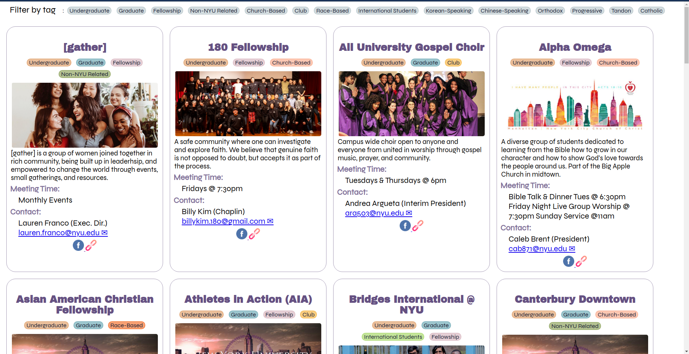

# NYU CIFC Functions

> This is a collection of utilities used on the [NYU CIFC](https://nyucifc.org) website.

### NYU Clubs

> As seen [here](https://www.nyucifc.org/christian-clubs-at-nyu)



**[Check out a sample here!](https://laudebugs.github.io/cifc/)**

### Things to Note

-   When you update the spreadsheet, the column names should be updated in this repo as well
    As the model expects the following shape:
    ```json
    {
        "Name": "180 Fellowship",
        "Tags": "Undergraduate, Fellowship, Church-Based",
        "Description": "A safe community where one can investigate and explore faith. We believe that genuine faith is not opposed to doubt, but accepts it as part of the process.",
        "For Undergraduate or Graduate Students": "Undergraduate",
        "Weekly Meeting Time 2021 - 2022": "Fridays @ 7:30pm",
        "Meeting Place": "GSCAL",
        "Main Contact person": "Pastor Billy Kim - SLA",
        "Email": "billykim.180@gmail.com",
        "Website": "http://180church.tv/",
        "Facebook": "https://www.facebook.com/180fellowship",
        "cover": "180-fellowship.jpeg"
    }
    ```
    So, make sure to update the [script](./public/main.js) to match the new column names.

### Updating on Squarespace

From the [home page](https://oleander-radish-xdat.squarespace.com/config/), go to `Settings > Advanced > Code Injection` and paste the contents of the [script here](https://raw.githubusercontent.com/laudebugs/cifc/release/squarespace.html) into the **Header** field.

## Updating a Club's Cover Image

Simply add the image to the [`assets/covers`](./assets/covers) with the **club's name** as listed in the Clubs Spreadsheet and update the repository.
